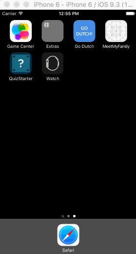

# GoDutch

Time spent: 7 hours spent in total

Completed user stories:

* [x] Required: User can enter the bill amount
* [x] Required: User can select from three tip percentage options
* [x] Required: User can navigate to SettingsViewController from ViewController
* [x] Required: User can select and set their default tip percentage from the Settings Page
* [x] Required: Tip percentage value that is set in the Settings will persist on the home screen once the user selects the new default value and clicks "Save" button

* [x] Optional: added a custom app icon image
* [x] Optional: added a custom splash screen
* [x] Optional: allow users to clear value from bill amount field while editing
* [x] Optional: set the billField as the first responder to maximize efficiency, leaving keyboard visible 
* [x] Optional: used custom icons for settings icon (on home page) and back icon (from settings modal)
* [x] Optional: used animated view properties to bring focus to bill amount text input when null
* [x] Optional: added custom font Salesforce Sans, and changed the font colors/sizes throughout the app
* [x] Optional: added a custom reminder that appears once a value is entered into the tip amount field
* [x] Optional: created a custom settings modal using objects from Salesforce Lighting Design System (https://lightningdesignsystem.com/)
* [x] Optional: added toast on settings modal (once user clicks save) to communicate that the changes have been saved

Demo of user stories:

GIF created with [LiceCap](http://www.cockos.com/licecap/)
